注：本文档查看需要先下载Typora，同级目录文件夹不能删除

## 一.安装jdk8

#### 1.参考：https://www.cnblogs.com/heqiyoujing/p/9502726.html

## 二.安装maven

#### 1.maven安装参考：https://www.cnblogs.com/happyday56/p/8968328.html

## 三.准备开发工具idea

去官网下载社区版，地址：https://www.jetbrains.com/idea/download/#section=windows

#### 1.有两种选择，下载收费版和社区版，收费版需要序列号插件更多，社区版免费基本功能够用。下面以社区版为例

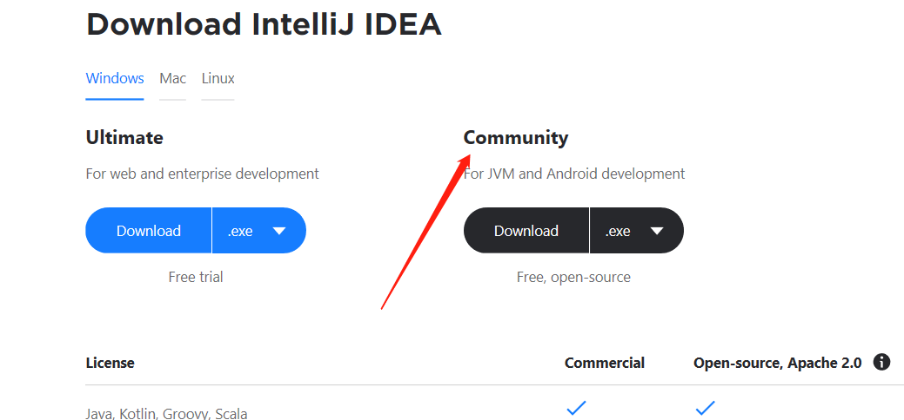

> 下载后傻瓜式安装，我安装在建议安装在c盘以外的位置，安装好后然后点击下图的exe，即可运行使用idea

.png)

#### 2.创建代码自动构建设置

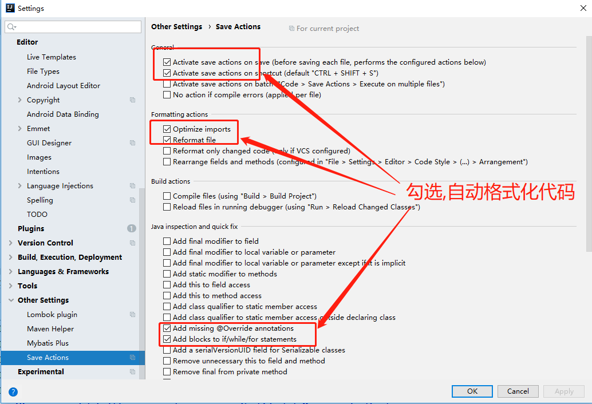

#### 3.其他设置

```

## supplyChainFinancePlatform项目 ##
#### 前后端不分离jdk1.7 or jdk1.8 编译，tomcat7部署 ####
*[idea运行ssm项目](https://www.jianshu.com/p/79777b8a17b2)*  
1. idea 里 打开Tomcat 配置 在VM options 加入  `-Dfile.encoding=UTF-8`
2. tomcat如果出现`淇℃伅`乱码字符，找到Tomcat目录下的conf/logging.properties配置文件，搜索java.util.logging.ConsoleHandler.encoding，将默认UTF-8改为GBK，保存重启tomcat即可
----------

#### idea插件安装
- [lombok（必装）](https://jingyan.baidu.com/article/0a52e3f4e53ca1bf63ed725c.html)
- [Free MyBatis plugin（推荐）](https://blog.csdn.net/fanrenxiang/article/details/83745309)
- [阿里巴巴规范插件](https://blog.csdn.net/weixin_39220472/article/details/80077803)
- [好用的idea插件](http://www.ctoutiao.com/2554916.html)
- [更多插件安装](https://www.cnblogs.com/fstimers/articles/10808917.html)
```

## 四.配置git

#### 1.在电脑上安装git 参考：https://www.cnblogs.com/ximiaomiao/p/7140456.html

#### 2.idea配置git ,如下图

点击file,然后settings，如下图配置

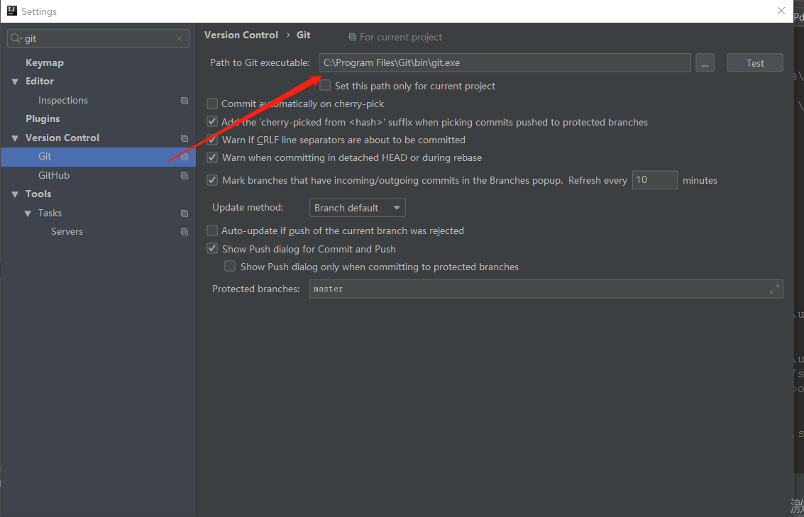

其中Path toGit executable地址是你选择安装的git目录

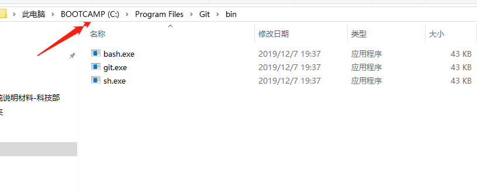

#### 3.idea配置maven

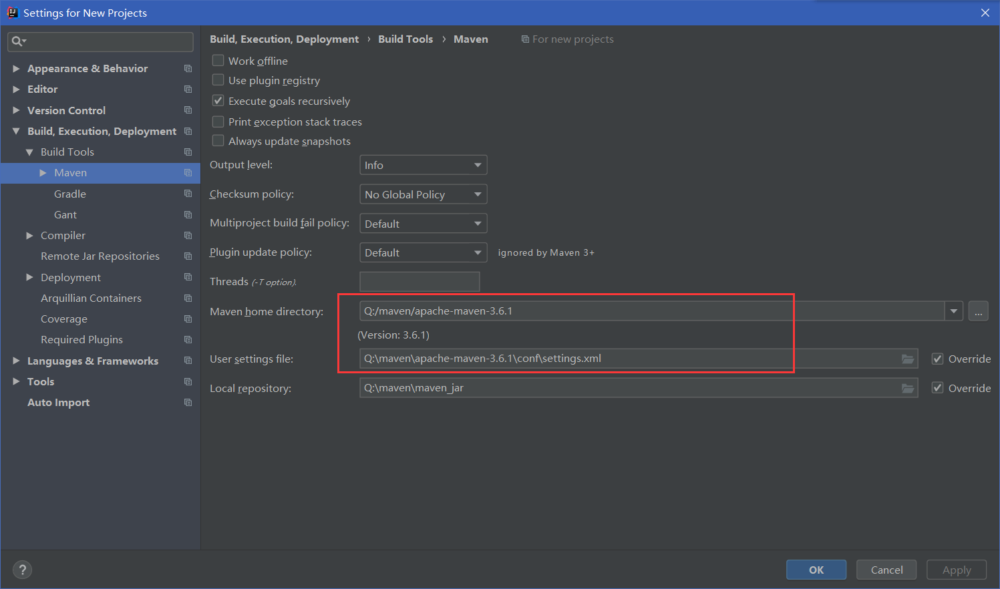

设置好maven仓库，选择你本地的maven仓库地址以及setings文件。setting文件设置

## 五.安装openoffice

#### 1.下载地址：http://192.168.31.120:8081/工具包，[Apache_OpenOffice_4.1.5_Win_x86_install_zh-CN.exe]下载后傻瓜式安装

## 六.安装mysql

> **这里可以选择安装或者不安装，如果不安装，本项目直接连接192.168.31.159:3306数据库。**

#### 1.下载地址：http://192.168.31.120:8081/工具包 ，下载[mysql-installer-community-5.7.22.1.msi] 傻瓜式安装，

记得安装的时候注意设置账号密码root,root

注意：本项目必须选择安装上述版本，否则会报错，理论上讲还要注意编码格式utf8

## 七.安装tomcat

#### 1.下载地址：http://192.168.31.120:8081/工具包 ，下载安装[apache-tomcat-9.0.26.exe](http://192.168.31.120:8081/工具包/apache-tomcat-9.0.26.exe)，放到合适目录安装自定义

#### 2.idea配置tomacat,首先点击配置如下图

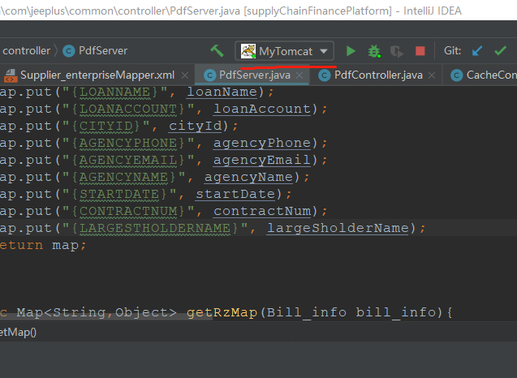

点击如图所示空白处，然后出现editconfigs,点击如下

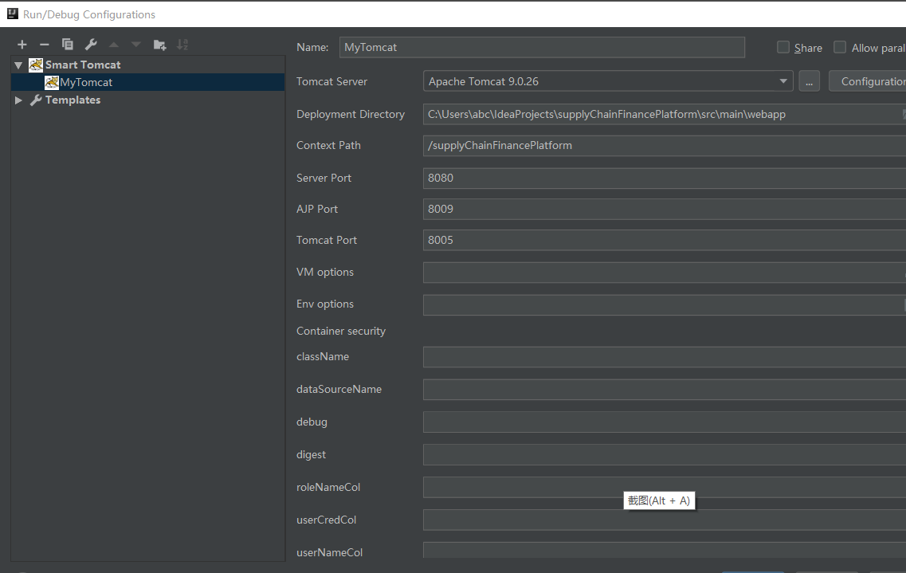

如果是社区版

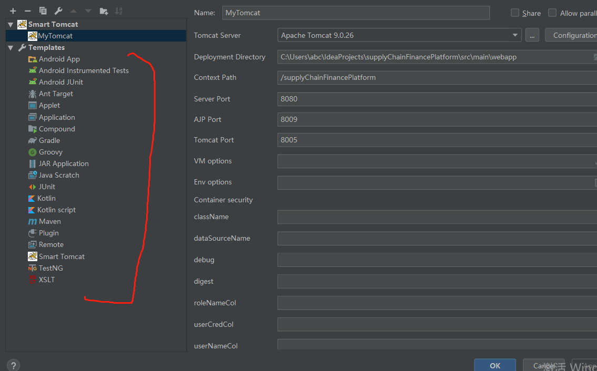

Templates一般没有Tomcat选项。

这个时候需要我们去下载一个插件。

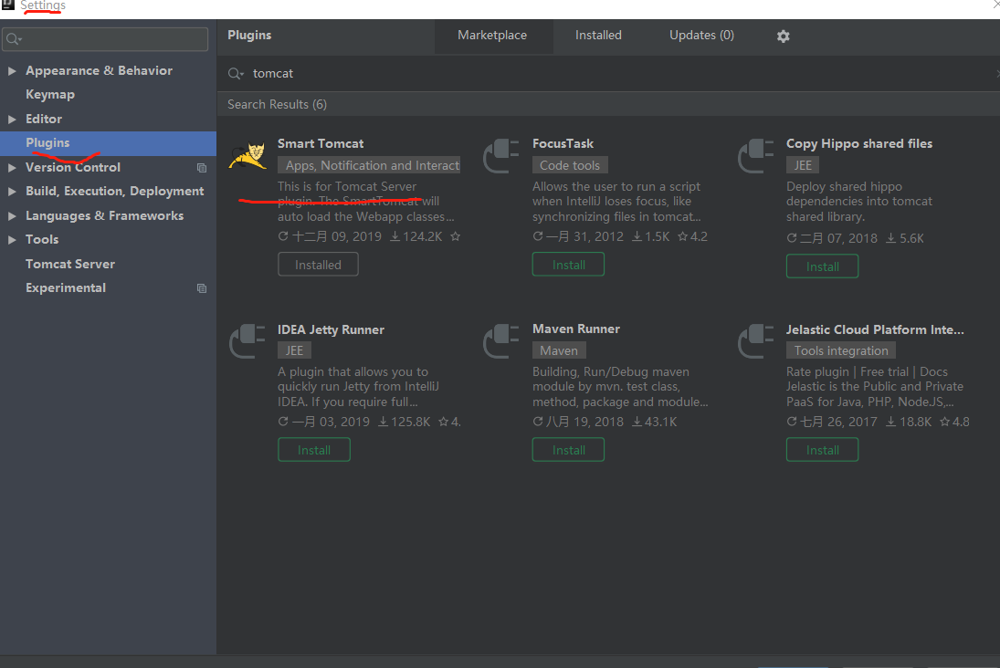

如图所示选择红线的插件进行安装。

安装完成之后需要重新启动idea，然后点击下图的Smart Tomcat点击左上角的加号，配置你的tomcat的地址，以及点击configuration或者三个点号，例如我的 C:\Program Files\Apache Software Foundation\Tomcat 9.0，只需要配到这个目录即可


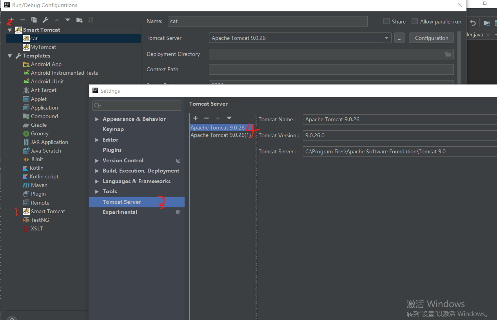

然后，选择Deployment Directory,指向项目的webapp目录即可


## 八.拉取项目

点击file，new project from version control 选择git 

如下，填写地址克隆项目：http://192.168.31.120:3000/zuogangju369/supplyChainFinancePlatform.git

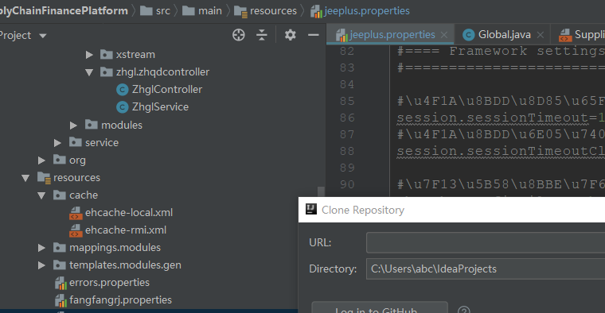

拉取项目


## 九.项目启动前准备

#### 1.配置好数据源，如果自己本地已经安装好mysql 5.7，请执行下面的

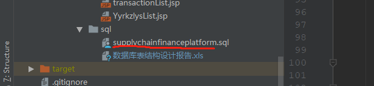

#### 2.如果自己本地没有数据库，则考虑在:jeeplus.properties配置，如果自己有数据库，则改成127.0.0.1

#### `jdbc.url=jdbc:mysql://192.168.31.159:3306/supplyChainFinancePlatform?useUnicode=true&characterEncoding=utf-8`

#### 3.启动tomcat，即可。

## 十.项目总结

#### 1.本项目前端技术实现是jsp ，跟后端的交互依赖于servlet，具体请参考https://www.jianshu.com/p/e64a0c380d41


1. 类注释、类属性注释、方法注释、方法内关键代码注释(类注释需要体现作者名称)
2. 项目中关于返回对象不要使用JsonObject、Object、HashMap这类不明确的返回对象,
		除非有特殊需求必须这么要使用才可以
3. try catch,catch块中需要打印log信息方便定位问题
4. controller对外返回json对象ServerResponse<T> 泛型中的T一定要明确,有特殊需求可特殊对待
5. 注解@ResponseBody @RequestBody @PathVariable @RequestParam
6. 其他代码规范根据阿里的插件规范来即可


